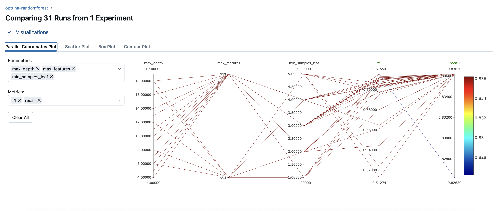
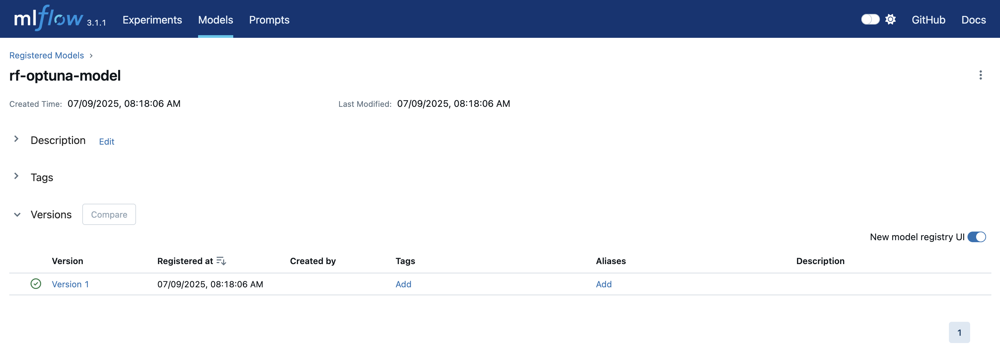

[](badges/coverage.svg)

# Customer Churn Prediction

This project is a practical example of implementing the full **MLOps workflow** in a real-world scenario, including data versioning, experiment tracking, pipeline orchestration, model deployment, and performance monitoring.

---
## Table of Contents

- [Problem Statement](#problem-statement)
- [Project Structure](#project-structure)
- [Data Processing](#data-processing)
- [Model Selection](#model-selection)
- [Experiment Tracking](#experiment-tracking)
- [Orchestration](#orchestration)
- [Monitoring](#monitoring)
- [Setup & Usage](#setup--usage)
- [Potential Improvements](#potential-improvements)

---

### Problem Statement

Customer churn — the loss of clients or subscribers — is a critical problem for many businesses, especially in highly competitive markets like telecommunications. Being able to identify customers who are likely to leave helps companies take preventive actions such as offering incentives or personalized support.

This project aims to build a machine learning system that predicts customer churn based on historical telecom user data. The solution is designed to be end-to-end, from data ingestion and preprocessing to model deployment and monitoring, following modern MLOps best practices.

#### Goal

The main goal is to develop a robust and reproducible system that identifies customers with a high risk of churn so that the business can proactively retain them and reduce customer loss.

---

### Project Structure

*(Insert description and image here)*

#### Tools and Techniques

- **MLflow** – Experiment tracking and model registry
- **Prefect** – Workflow orchestration for training and monitoring flows
- **Streamlit** – Simple and interactive UI for model inference
- **Docker** – Containerization for reproducible deployment
- **Grafana + Prometheus + Evidently** – Monitoring model performance and data drift
- **GitHub Actions** – CI/CD pipeline for tests and linting
- **Makefile, pre-commit, flake8** – Reproducibility and code quality
---

### Data Processing

The dataset used in this project is the [Telco Customer Churn dataset](https://www.kaggle.com/datasets/blastchar/telco-customer-churn) from Kaggle, containing customer demographics, service usage, and contract details.

During preprocessing, rows with missing `TotalCharges` values were removed and the column was converted to numeric. The target column `Churn` was mapped to binary values ("Yes" → 1, "No" → 0).

The target variable is imbalanced (≈26% churned), so **stratified** splitting was used to preserve class distribution across:
- 60% training
- 20% validation
- 20% test

Numerical features were standardized with `StandardScaler`, and categorical features encoded with `OneHotEncoder`. All preprocessing is performed within a `ColumnTransformer`, integrated into a `Pipeline` with the model, so that preprocessing and prediction remain consistent during inference.

---

### Model Selection

Two classification models were trained and compared: **Logistic Regression** and **Random Forest**, both implemented using Scikit-learn. The training logic is split across multiple scripts, including data preprocessing, splitting, and model training, and is orchestrated as a pipeline using Prefect.

Hyperparameter tuning was performed with **Optuna**, and all experiments were tracked using **MLflow**. Class imbalance was handled using `class_weight="balanced"`.

Below are the results on the validation set:

| Metric      | Logistic Regression | Random Forest     |
|-------------|---------------------|-------------------|
| Accuracy    | 0.773               | 0.728             |
| Precision   | 0.555               | 0.493             |
| Recall      | 0.730               | 0.826             |
| F1 Score    | 0.630               | 0.617             |
| ROC AUC     | 0.759               | 0.759             |

While Logistic Regression achieved higher precision, **Random Forest** provided significantly better recall, which is valuable when minimizing false negatives (i.e., failing to identify churners).

Considering the business use case and model performance, **Random Forest** was selected as the final model and deployed for inference.

> **Note:** The primary goal of this project is to demonstrate an end-to-end MLOps pipeline rather than maximizing model performance. Therefore, modeling was intentionally kept simple and focused on explainability and maintainability.
---

### Experiment Tracking

All model training and tuning experiments were tracked using **MLflow**, which logs parameters, metrics, and artifacts for each run. This makes it easy to compare experiments and ensures reproducibility of results.

MLflow was integrated directly into the training and optimization pipeline. During hyperparameter tuning with **Optuna**, each trial was logged as a separate MLflow run, including:

- model type and hyperparameters,
- training and validation metrics,
- preprocessing configuration,
- serialized model artifacts.

To ensure environment consistency, MLflow runs inside a **Docker container** along with the training pipeline. This allows all tracking to happen in an isolated, reproducible setup.

Trained models are also registered in the **MLflow Model Registry** from within the container, enabling version control and consistent deployment.

Below is a parallel coordinates plot from MLflow showing how Random Forest hyperparameters influenced F1-score and recall during Optuna tuning.

Only Random Forest results are shown, as its parameters are not directly comparable with other model types.



The best-performing models were registered in the MLflow Model Registry:


---

### Orchestration

All pipelines in this project are orchestrated using **Prefect** — a modern workflow orchestration framework.

Two main flows are defined in this project:

- `train_flow.py` – executes the full pipeline: data ingestion, preprocessing, model training, evaluation, and MLflow registration.
- `monitoring_flow.py` – runs daily data drift checks using **Evidently**.

Deployment definitions are managed programmatically in `create_deployment.py`, using `Deployment.build_from_flow()` with scheduled execution via `CronSchedule`.

Once the Prefect server is up (via Docker Compose), the deployments can be applied with:

```bash
python create_deployment.py
```

This registers the following daily flows in the Prefect UI:

- `daily-training` – runs every day at 06:00
- `daily-monitoring` – runs every day at 06:30

You can monitor, trigger, and manage flow runs via the Prefect dashboard (http://localhost:4200).


---

### Monitoring

*(Describe Evidently, Prometheus, Grafana integration, etc.)*

---

### Setup & Usage

#### Prerequisites

- Python 3.10 or higher ([Install Python](https://www.python.org/downloads/))
- Docker + Docker Compose ([Install Docker](https://docs.docker.com/get-docker/))
- Prefect CLI v2 ([Installation guide](https://docs.prefect.io/latest/getting-started/installation/))
- Git

*(Include prerequisites, installation steps, how to run the app, and access links.)*

---

### Potential Improvements

---

#### Tasks summary
