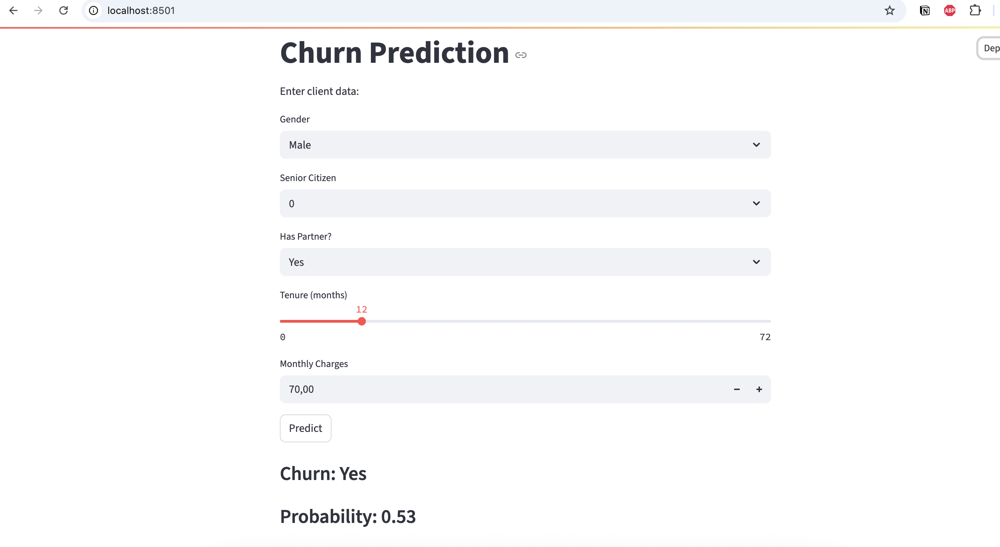
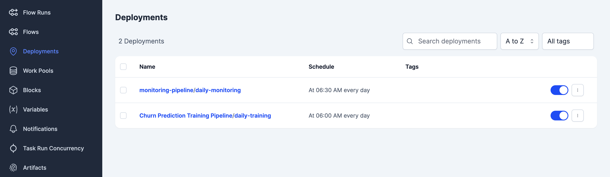
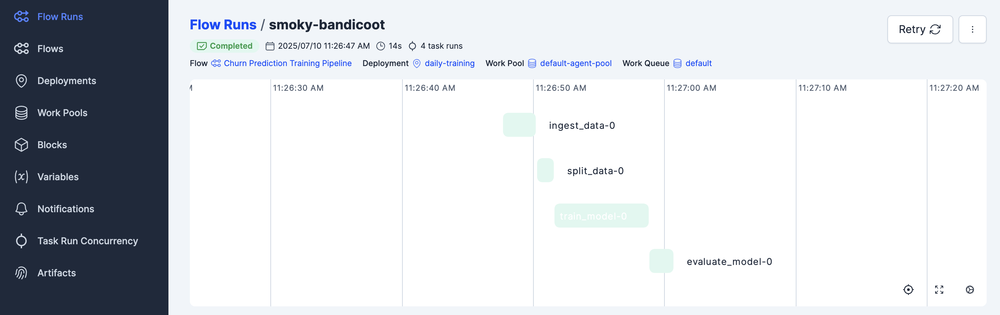
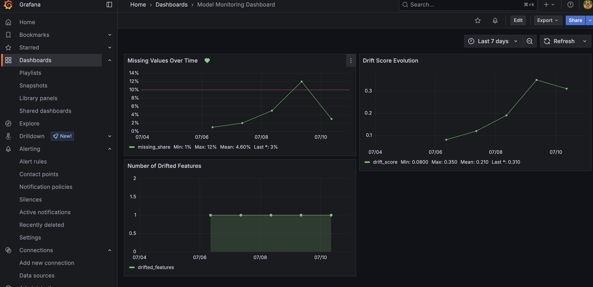
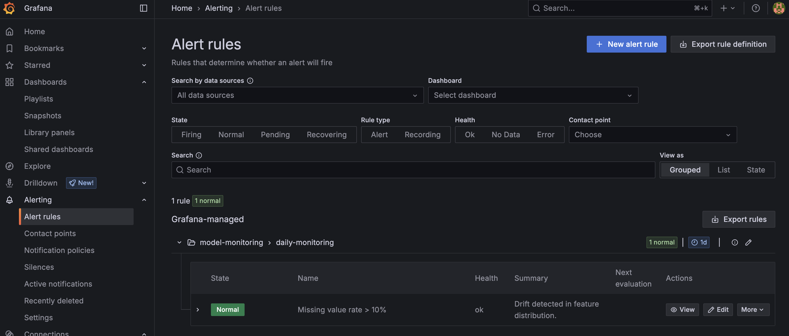

[](badges/coverage.svg)

# Customer Churn Prediction

This project is a practical example of implementing the full **MLOps workflow** in a real-world scenario, including data versioning, experiment tracking, pipeline orchestration, model deployment, and performance monitoring.

---
## Table of Contents

- [Problem Statement](#problem-statement)
- [Project Structure](#project-structure)
- [Data Processing](#data-processing)
- [Model Selection](#model-selection)
- [Experiment Tracking](#experiment-tracking)
- [Model Deployment](#model-deployment)
- [Orchestration](#orchestration)
- [Monitoring](#monitoring)
- [Setup & Usage](#setup--usage)
- [Code Quality & Automation](#code-quality--automation)
- [Potential Improvements](#potential-improvements)

---

### Problem Statement

Customer churn — the loss of clients or subscribers — is a critical problem for many businesses, especially in highly competitive markets like telecommunications. Being able to identify customers who are likely to leave helps companies take preventive actions such as offering incentives or personalized support.

This project aims to build a machine learning system that predicts customer churn based on historical telecom user data. The solution is designed to be end-to-end, from data ingestion and preprocessing to model deployment and monitoring, following modern MLOps best practices.

#### Goal

The main goal is to develop a robust and reproducible system that identifies customers with a high risk of churn so that the business can proactively retain them and reduce customer loss.

---

### Project Structure

The project follows a clean, modular structure aligned with MLOps best practices. Core components like data ingestion, preprocessing, training, and monitoring are organized in the `src/` directory. Configuration files are stored under `config/`, and workflows are orchestrated via Prefect flows located in `orchestration/`. Utility functions and logging are grouped under `utils/`. Infrastructure files such as Docker configuration, CI/CD pipelines, Makefile, and pre-commit setup are included in the root directory to ensure easy setup and reproducibility.


#### Tools and Techniques

- **MLflow** – Experiment tracking and model registry
- **Prefect** – Workflow orchestration for training and monitoring flows
- **Streamlit** – Simple and interactive UI for model inference
- **Docker** – Containerization for reproducible deployment
- **Grafana + Evidently** – Monitoring model performance and data drift
---

### Data Processing

The dataset used in this project is the [Telco Customer Churn dataset](https://www.kaggle.com/datasets/blastchar/telco-customer-churn) from Kaggle, containing customer demographics, service usage, and contract details.

During preprocessing, rows with missing `TotalCharges` values were removed and the column was converted to numeric. The target column `Churn` was mapped to binary values ("Yes" → 1, "No" → 0).

The target variable is imbalanced (≈26% churned), so **stratified** splitting was used to preserve class distribution across:
- 60% training
- 20% validation
- 20% test

Numerical features were standardized with `StandardScaler`, and categorical features encoded with `OneHotEncoder`. All preprocessing is performed within a `ColumnTransformer`, integrated into a `Pipeline` with the model, so that preprocessing and prediction remain consistent during inference.

---

### Model Selection

Two classification models were trained and compared: **Logistic Regression** and **Random Forest**, both implemented using Scikit-learn. The training logic is split across multiple scripts, including data preprocessing, splitting, and model training, and is orchestrated as a pipeline using Prefect.

Hyperparameter tuning was performed with **Optuna**, and all experiments were tracked using **MLflow**. Class imbalance was handled using `class_weight="balanced"`.

Below are the results on the validation set:

| Metric      | Logistic Regression | Random Forest     |
|-------------|---------------------|-------------------|
| Accuracy    | 0.773               | 0.728             |
| Precision   | 0.555               | 0.493             |
| Recall      | 0.730               | 0.826             |
| F1 Score    | 0.630               | 0.617             |
| ROC AUC     | 0.759               | 0.759             |

While Logistic Regression achieved higher precision, **Random Forest** provided significantly better recall, which is valuable when minimizing false negatives (i.e., failing to identify churners).

Considering the business use case and model performance, **Random Forest** was selected as the final model and deployed for inference.

> **Note:** The primary goal of this project is to demonstrate an end-to-end MLOps pipeline rather than maximizing model performance. Therefore, modeling was intentionally kept simple and focused on explainability and maintainability.
---

### Experiment Tracking

All model training and tuning experiments were tracked using **MLflow**, which logs parameters, metrics, and artifacts for each run. This makes it easy to compare experiments and ensures reproducibility of results.

MLflow was integrated directly into the training and optimization pipeline. During hyperparameter tuning with **Optuna**, each trial was logged as a separate MLflow run, including:

- model type and hyperparameters,
- training and validation metrics,
- preprocessing configuration,
- serialized model artifacts.

To ensure environment consistency, MLflow runs inside a **Docker container** along with the training pipeline. This allows all tracking to happen in an isolated, reproducible setup.

Trained models are also registered in the **MLflow Model Registry** from within the container, enabling version control and consistent deployment.

Below is a parallel coordinates plot from MLflow showing how Random Forest hyperparameters influenced F1-score and recall during Optuna tuning.

Only Random Forest results are shown, as its parameters are not directly comparable with other model types.


The best-performing models were registered in the MLflow Model Registry:


---

## Model Deployment

The trained churn prediction model is deployed using [Streamlit](https://streamlit.io/), a lightweight Python framework for building interactive web applications.

In this project, a simple Streamlit app was developed to demonstrate how predictions can be served to end users through an intuitive web interface.
Users can manually input selected customer features, and the model returns a prediction and probability of churn.

**Note:** This UI is intended for demonstration purposes only. It uses a limited subset of input features and is not designed for full production use.

Example of the Streamlit interface:



---

### Orchestration

All pipelines in this project are orchestrated using **Prefect** — a modern workflow orchestration framework.

Two main flows are defined in this project:

- `train_flow.py` – executes the full pipeline: data ingestion, preprocessing, model training, evaluation, and MLflow registration.
- `monitoring_flow.py` – runs daily data drift checks using **Evidently**.

Deployment definitions are managed programmatically in `create_deployment.py`, using `Deployment.build_from_flow()` with scheduled execution via `CronSchedule`.

Once the Prefect server is up (via Docker Compose), the deployments can be applied with:

```bash
python create_deployment.py
```

This registers the following daily flows in the Prefect UI:

- `daily-training` – runs every day at 06:00
- `daily-monitoring` – runs every day at 06:30

You can monitor, trigger, and manage flow runs via the Prefect dashboard (http://localhost:4200).

Below is an example of registered deployments shown in the Prefect UI:



Timeline of a successful training_pipeline run showing task execution in Prefect UI.



---

### Monitoring

To monitor model performance and data quality over time, a daily monitoring flow was implemented. It uses **Evidently** to compute key metrics like `missing_share`, `drift_score`, and `drifted_features`, which are saved to a **PostgreSQL** database and visualized using **Grafana**.

The monitoring flow runs automatically via **Prefect** and can be easily extended with additional checks. Alerting rules are configured in Grafana to notify when critical thresholds are exceeded.

#### Grafana Dashboard

The screenshot below shows the main **Grafana dashboard**, which visualizes trends in missing values, drift scores, and the number of drifted features:



#### Alerting Configuration

Alerts can be triggered when thresholds are reached — for example, the screenshot below shows an alert rule that fires if the `missing_share` exceeds 10%:



> ⚠️ *Note: The data shown in the screenshots was manually manipulated to visually demonstrate how the dashboards and alerts work.*


---

### Setup & Usage

#### Prerequisites

Make sure the following tools are installed:

- [Python 3.10+](https://www.python.org/downloads/)
- [Docker + Docker Compose](https://docs.docker.com/get-docker/)
- [Git](https://git-scm.com/)

#### Installation & Run

Clone the repository and start the full MLOps environment using Docker:

```bash
git clone https://github.com/your-username/churn-prediction
cd churn-prediction

# Start all services (MLflow, Prefect UI, Streamlit, Grafana, PostgreSQL, etc.)
docker-compose up -d
```

This command launches the full system. The container `churn-prediction-app` automatically:

- runs the training pipeline (data processing, model training, hyperparameter tuning),
- logs experiments to **MLflow**,
- registers and applies Prefect **deployments** (training and monitoring),
- starts the **Prefect agent**,
- launches the **Streamlit UI** for inference.

> ℹ️ Make sure ports `8501` (Streamlit), `4200` (Prefect), `5050` (MLflow), and `3000` (Grafana) are available on your machine.

All dependencies are pinned in `requirements.txt`. Configurations are stored in YAML files under the `config/` directory and managed centrally.

#### Access

Once the environment is running, the following services are available:

| Service         | URL                       | Credentials     |
|-----------------|---------------------------|-----------------|
| MLflow UI       | http://localhost:5050     | -               |
| Streamlit App   | http://localhost:8501     | -               |
| Prefect UI      | http://localhost:4200     | -               |
| Grafana         | http://localhost:3000     | admin / admin   |

---

### Code Quality & Automation

This project follows modern development practices to ensure code readability, maintainability, and reliability:

- **Black** – automatic code formatting
- **isort** – import sorting
- **pylint** – static code analysis
- **pytest** – test framework with coverage reporting
- **pre-commit hooks** – automatic checks before each commit
- **GitHub Actions** – CI pipeline defined in `.github/workflows/ci.yaml`

All code is checked automatically on push and pull request.

---

### Potential Improvements

- **Improve model accuracy** through advanced feature engineering and model tuning.
- **Enhance the Streamlit UI** by allowing full feature selection and visual explanations (e.g., SHAP).
- **Deploy to the cloud** using AWS Fargate or similar managed infrastructure.
- **Adopt Infrastructure as Code (IaC)** to automate cloud resource provisioning (e.g., Terraform).
- **Extend testing coverage** by adding unit tests for all modules and implementing integration tests.

---

#### Tasks summary

This project provides an end-to-end solution for predicting customer churn, following key MLOps principles. Summary of completed components:

- The problem is clearly described in the "Problem Statement" section.
- The project runs locally using Docker Compose; cloud deployment and IaC are listed as potential improvements.
- MLflow is used for experiment tracking and model registry.
- Prefect is used for orchestration of both training and monitoring pipelines.
- The model is deployed via a simple Streamlit UI for inference, included in the Docker setup.
- Model monitoring is implemented using Evidently with visualizations and alerts in Grafana.
- The setup is reproducible with pinned dependencies, clear instructions, and containerized services.
- Good practices applied:
  - Unit tests with pytest
  - Linting and formatting (black, isort, pylint)
  - Pre-commit hooks
  - Makefile for automation
  - CI/CD pipeline via GitHub Actions
